  

 

  

---

<table width="100%" cellspacing="0" cellpadding="0" border="0">
<tr>

<td width="48%" valign="top">

### 🎯 Current Focus
- Data Structures & Algorithms
- Full-Stack Web Development
- AI-Augmented Problem Solving

### 🛠️ Languages & Tech

  

### 🧰 Tools & IDEs

  

### 📊 GitHub Stats

</td>

<td width="4%"></td>

<td width="48%" valign="top">

### 📜 LeetCode Performance

  

### 📈 Contribution Flow

  

### 🧠 Core Principles
- 🔁 **Consistency** — Showing up every day.
- ⚙️ **Execution** — Building real solutions.
- 🧱 **Structure** — Writing code that lasts.

</td>
</tr>
</table>

---

  

 

  
  &nbsp;
  
  &nbsp;
  
  
    
  

