<table width="100%" border="0" cellspacing="0" cellpadding="0">
  <tr>
    <td width="70%" align="center">
      
    </td>
    <td width="30%" align="right" valign="bottom">
      
    </td>
  </tr>
</table>

 

<table width="100%" cellspacing="0" cellpadding="0" border="0">
<tr>

<td width="48%" valign="top">

### Core Engineering Focus
- Data Structures and Algorithms: Focus on efficiency and complexity in C++ and Python.
- Software Engineering: Building maintainable and scalable web architectures.
- AI Integration: Implementing artificial intelligence features within full-stack applications.

### Programming Languages

  

### Tools and Infrastructure

  

### Technical Recognition

### Top Languages by Repo

</td>

<td width="4%"></td>

<td width="48%" valign="top">

### GitHub Trophies

### LeetCode Performance

  

### Development Consistency

  

### System Activity

### Top Languages by Commit

</td>
</tr>
</table>

---

### Global Profile Summary

  

  

---

 

---

### Let's Build Something Great Together

  
  &nbsp;
  
  &nbsp;
  

**Status:** Open to interesting opportunities & collaborations

 

### Engineering Philosophy
> **"The best way to predict the future is to implement it."**

Passionate about solving complex problems through clean code, continuous learning, and collaborative engineering. Transforming ideas into scalable solutions that make an impact.

 

 

If you found this helpful, please give it a ⭐ — it means a lot! 💙

